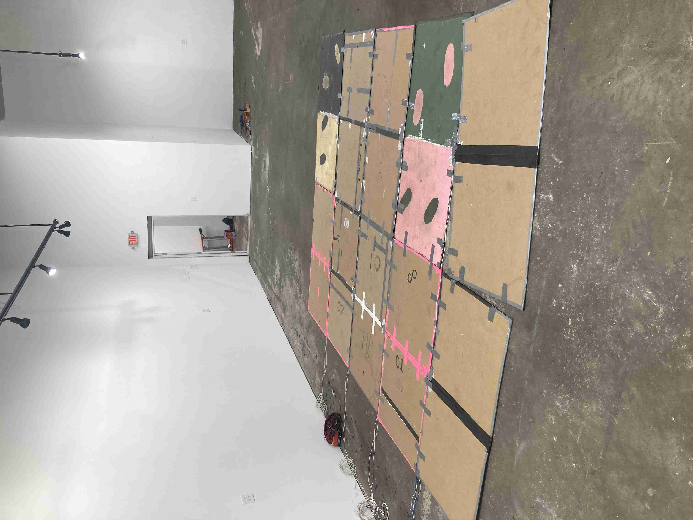

# pressure sensitive dance floor

an array of 20 pressure sensitive floor pads to create an interactive dance floor. 

## Description

The pads are made with Velostat, a piezoresistive material, and inspired by the amazing duo "[Kobakant](https://www.kobakant.at/)" and their DIY Wearable technology, and their How To Get What You Want website. I used their [documentation website](https://www.kobakant.at/DIY/?p=7943) in the early prototyping phase a lot. If you are curious about how Velostat works, or how you can create a voltage divider with it, check out the above site, it is an amazing resource with great diagrams 🌈

Each pad of this dance floor is ~35" x 35", and made with Velostat, aluminum foil, cardboard, aluminum tape, and wires. They hook up to enclosure boxes that read in the analog value of the pad and convert it into a MIDI CC message. 

Some early documentation of this system being used for installations can be found at my website for the [Art on the Beltline project](https://freakylamps.com/productions/dancefloor/) and the [Bleep Bleep installation](https://freakylamps.com/productions/bleepbleep/)

# Technical Info
- there are 3 Teensy 3.2 microcontrollers that run the system. The code for them is in this github. 
- There are two control boxes for the system. Box 1 contains one Teensy, box 2 contains 2 Teensys.  
  - Box 1
  - Box 2, teensy 1
  - Box 2, teensy 2
-  They read in analog values from the pads and convert that to MIDI over USB. 
- I know.. one teensy 3.2 has 21 analog inputs so why use 3??? laziness. This was a system that evolved over the years with a few public art installations. and basically I didn't want to rebuild it and simplify it, it was easier to use all 3 as is. 
  - box 1 contains 1 microcontroller. It reads in 10 pads
  - the second box contains two microcontrollers, each does 5 pads. 
## MIDI CC
- We are using MIDI CC to send the pressures because the pressure pads are an analog sgnal 
- The system is currently programmed to send MIDI CC messages. Channel 1, CC 11 though 30. 
  - Box 1 does CC 11 - 20
  - Box 2-MCU1 does CC 21-25 
  - Box 2-MCU2 does CC 26-30
## MIDI USB names
(when using all 3 at once, my computer just called them all the same name, arbitrarily picked from one of the below. They are all supposed to show up as different names)
- box 1 = `Mididance1`
- box 2, teensy 1 = `Mididancebox2t1`
- box 2, teensy 2 = `Midibox2t2!`

## Getting Started

### quick start guide

* plug in the panels into the enclosure boxes via the JST pigtails coming out of the box
* hook up the box into the computer via USB-micro cable.
* pull up a program that reads in MIDI messages. 
  

## common problems

- the pads are finicky. The weak point of connection is where the wires go into the pads. Ive had to re-tape the connections many times using conductive tape. make sure you are using tape that is conductive ON BOTH SIDES! Recently, I started using copper tape and could solder the wire directly to that, which was very helpful. 

## Acknowledgments

Inspiration, code snippets, etc.
* [awesome-readme](https://github.com/matiassingers/awesome-readme)
* [PurpleBooth](https://gist.github.com/PurpleBooth/109311bb0361f32d87a2)
* [dbader](https://github.com/dbader/readme-template)
* [zenorocha](https://gist.github.com/zenorocha/4526327)
* [fvcproductions](https://gist.github.com/fvcproductions/1bfc2d4aecb01a834b46)